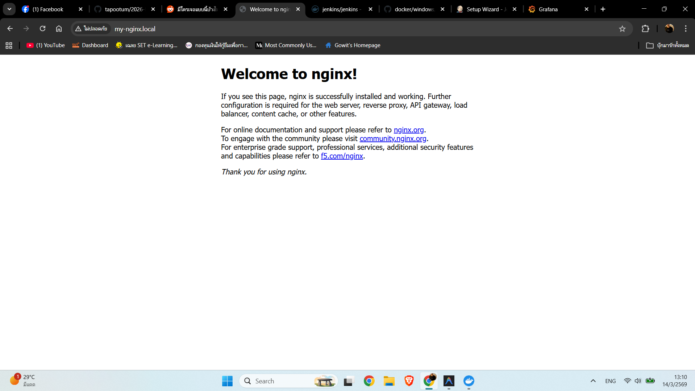
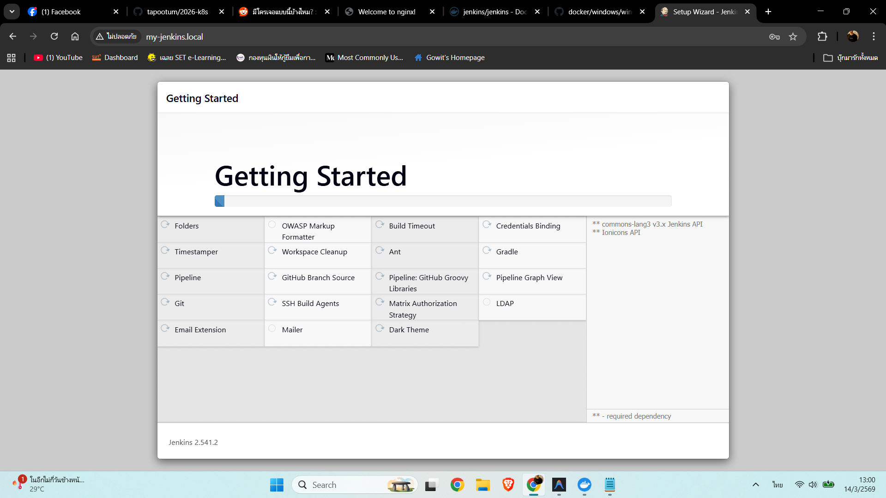
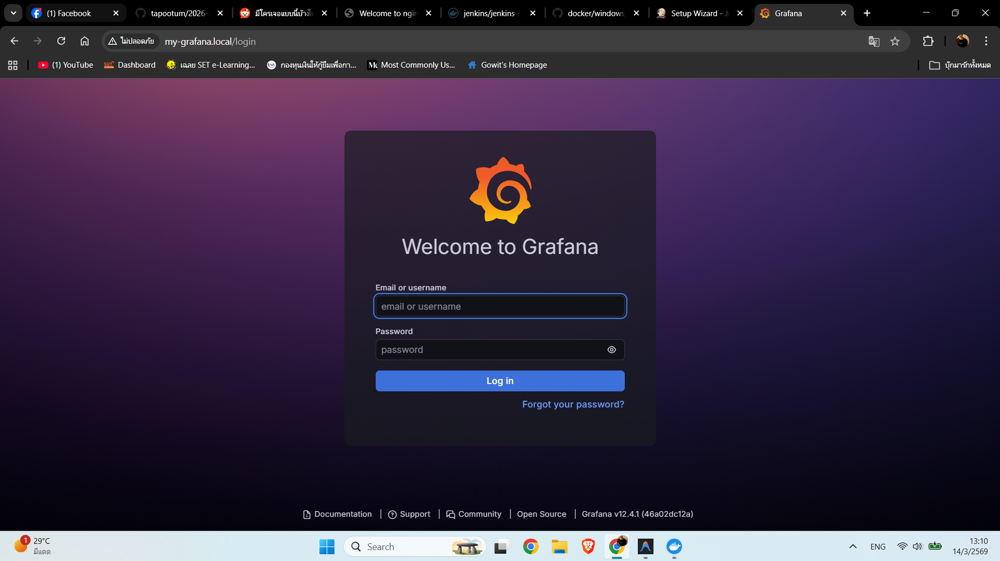

**B6639983 นายโกวิท ภูอ่าง**

## ติดตั้ง Ingress Controller
```bash
kubectl apply -f https://raw.githubusercontent.com/kubernetes/ingress-nginx/controller-v1.8.2/deploy/static/provider/cloud/deploy.yaml
```

## Deploy Jenkins
```bash
kubectl apply -f ./jenkins/deployment/
kubectl apply -f ./jenkins/service/
kubectl apply -f ./jenkins/ingress/
```

## Deploy Grafana
```bash
kubectl apply -f ./grafana/deployment/
kubectl apply -f ./grafana/service/
kubectl apply -f ./grafana/ingress/
```

## Screenshots

<p align="center">
  
</p>

<p align="center">
  
</p>

<p align="center">
  
</p>